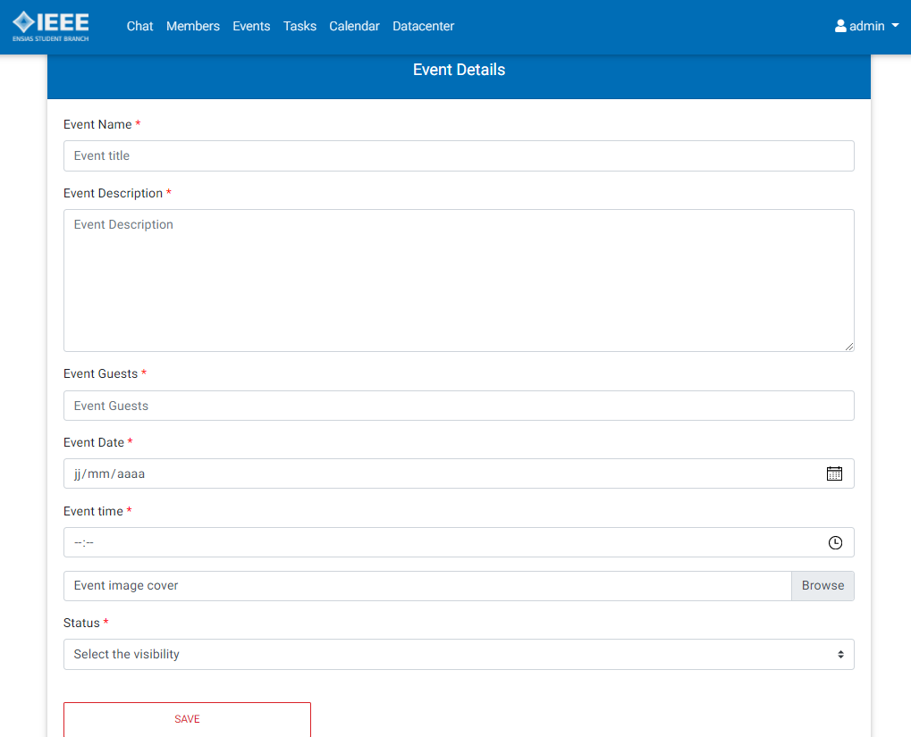

# IEEE ENSIAS Management System

This is an acedemic project to practice the course we had in JEE, Servlets, JSP, JSTL, and more ...

The main goal of this web app is to manage and organize the work within the IEEE ENSIAS Student Branch. We have mainly 4 actors (admin who is the current president, chef (head) of cell, webmaster and a simple member). Each type of actor has a different dashboard and pages after login. Also, all the actors have commun features like the chatroom, editing personal information, visualizing list of events and their dedicated tasks, and more ...

## Main Interfaces :

### Sign Up :

  

After Signing up, you will get an immediate confirmation email, and you need to wait until the admin accepts you within the student branch and updates your status. [Go to List of Members section](#list-of-members-).

### Login :

You can't login only after being accepted by the admin (president).

  

### Chatroom :

Everyone can type a message in the chat room.

  

### Create events :

Only admin and chefs can create an event.

  

### List of Events :

Only admin and chefs can update and delete events. The webmaster and members could only see the list and download the flyer.

  

### List of tasks :

Only admin and chefs can create, delegate and delete tasks.

  

### List of Members :

Only admin can update status of a member or delete it. Chefs can only see the list of members on his cell. Webmasters and members can't see this page.

  

### Editing Profile Information :

  

## 

Those are the main functunalities of the app, there is also other features like a personalized calendar (contains events and current tasks of each one), a data center (aka. Google Drive) to share files and documents between all members, a statistic board for webmaster (number of views, subscriptions per cell), newsletter handler, and more ...
